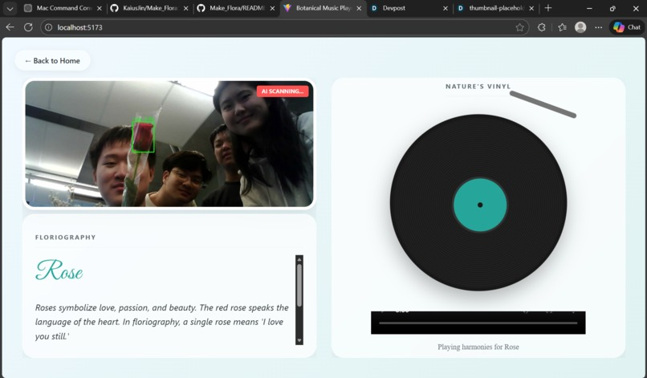

# Make_Flora

**A Valentine's Installation That Plays Music When You Show It Flowers**

> Botanical Music — hear the melody of every bloom. For Valentine's, we built an interactive installation that combines computer vision, floriography (the language of flowers), and hardware. Show a rose and the speaker plays one tune; show a bouquet and it plays another. A pulsing heart, driven by an op-amp, grows and shrinks with the moment.

[](https://devpost.com/software/make_flora?ref_content=my-projects-tab&ref_feature=my_projects) • **Submitted to MakeUofT 2026**

### Demo

[](https://www.youtube.com/watch?v=e7Ca_zsuNwA)

**[▶ Watch on YouTube](https://www.youtube.com/watch?v=e7Ca_zsuNwA)**

---

## Gallery

| | |
|:-------------------------:|:-------------------------:|
|  |  |
| **Make_Flora demo (Devpost)** | **Botanical Music Player app** |

> Add more screenshots to the `images/` folder as `3-opamp.png`, `4-team.png`, etc. (download from [Devpost](https://devpost.com/software/make_flora)).

---

## Concept

We wanted something romantic and playful for Valentine's — an experience that feels like flowers *talking* through music. Walk up with a rose, and the system recognizes it and plays a song. A separate ESP32 drives an I2S speaker, and an op-amp circuit controls a heart that pulses — bigger when there's a flower in view, smaller when there isn't.

---

## Flow

1. **Point the ESP32-CAM** at a flower or bouquet
2. **PC pulls frames** and sends them to Roboflow, receiving bounding boxes
3. **Server returns** `{ "name": "Rose" }` or `{ "name": "Flower Cluster" }` via `/detection`
4. **Speaker ESP32** polls that endpoint: Rose → song 1, Flower Cluster → song 2, no detection → silence
5. **Frontend** displays live video with bounding boxes and floriography text
6. **Op-amp heart** grows or shrinks based on detection intensity

---

## Floriography

| Flower | Language |
|--------|----------|
| **Rose** | Roses symbolize love, passion, and beauty. The red rose speaks the language of the heart. In floriography, a single rose means "I love you still." |
| **Flower Cluster** | A gathering of blooms speaks of abundance, joy, and the beauty of nature in full expression. |

---

## Tech Stack

| Layer | Tech |
|-------|------|
| Camera | ESP32-CAM, MJPEG stream |
| Detection | Roboflow serverless workflows (`find-roses`, `find-cluster-of-flowers`), YOLO |
| Backend | Python, Flask, OpenCV, MjpegStreamReader |
| Frontend | React, Vite, ReactPlayer |
| Speaker | ESP32, I2S DAC/amp, sine-wave synthesis |
| Heart | Op-amp circuit (Miller compensation), PWM/analog envelope, MOSFET, STM32 |

**Built with:** C++, ESP32, MOSFET, Op-amp, Python, Roboflow, Speaker, STM32, YOLO

---

## Setup

### 1. Clone the repo

```bash
git clone https://github.com/lee-cheng-han/Make_Flora.git
cd Make_Flora
```

### 2. Install Python dependencies

```powershell
pip install -r requirements.txt
```

### 3. Run detection (standalone)

```powershell
$env:CAMERA_SOURCE = "http://YOUR_ESP32_IP/stream"
.\run_rose_detect.ps1
```

### 4. Run the full web app

**Terminal 1 – detection server**
```powershell
$env:CAMERA_SOURCE = "http://YOUR_ESP32_IP/stream"
python detect_stream_server.py --api
```

**Terminal 2 – frontend**
```powershell
cd v1_plant_music_player/frontend
npm install && npm run dev
```

Open `http://localhost:5173`

### 5. ESP32-CAM setup

1. Open `ESP32_CAM_Stream/ESP32_CAM_Stream.ino` in Arduino IDE  
2. Set WiFi credentials (ssid, password)  
3. Board: **AI Thinker ESP32-CAM**  
4. Upload → Serial Monitor (115200) shows the IP  

### 6. Speaker ESP32 setup

1. Open `MakeUofT_2.3/MakeUofT_2.3.ino`  
2. Set `DETECTION_SERVER` to your PC's IP: `http://YOUR_PC_IP:5000/detection`  
3. Upload to the speaker ESP32  

---

## Challenges & Learnings

- **Speaker static** — HTTP polling blocked the main loop. Moving detection polling to a FreeRTOS task on another core kept the audio loop smooth.
- **IP addresses** — ESP32-CAM, PC, and speaker ESP32 must share the same subnet. Set `DETECTION_SERVER` and `CAMERA_SOURCE` to the correct IPs.
- **MJPEG on Windows** — `cv2.VideoCapture` was unreliable with ESP32 streams. A custom `MjpegStreamReader` that parses multipart boundaries worked better.

---

## Project Structure

| Path | Description |
|------|-------------|
| `detect_stream_server.py` | Flask server: detection + MJPEG stream with boxes |
| `webcam_rose_detect.py` | Main detection script (Roboflow API or local best.pt) |
| `MakeUofT_2.3/` | Speaker ESP32 sketch (I2S audio, HTTP polling) |
| `ESP32_CAM_Stream/` | ESP32-CAM streaming sketch |
| `v1_plant_music_player/frontend/` | React frontend (Floriography, Nature's Vinyl) |

---

## Team

- **Cheng Han Lee**
- **Kaixuan Jin**
- **Maggie Ma**
- **Shiheng Wang**

---

## Valentine's Twist

The heart circuit — driven by an op-amp and wired to grow or shrink with detection — turns the installation into a Valentine's piece. The heart pulses when flowers are in view and settles when they're gone. It's a small analog detail that ties the whole experience together.

*Built for Valentine's — flowers, music, and a heart that listens.*
